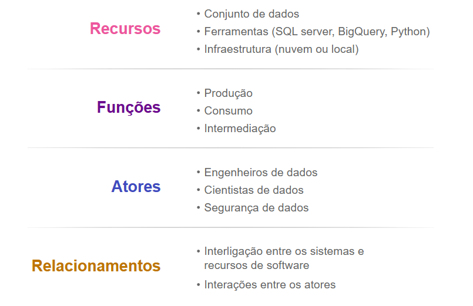
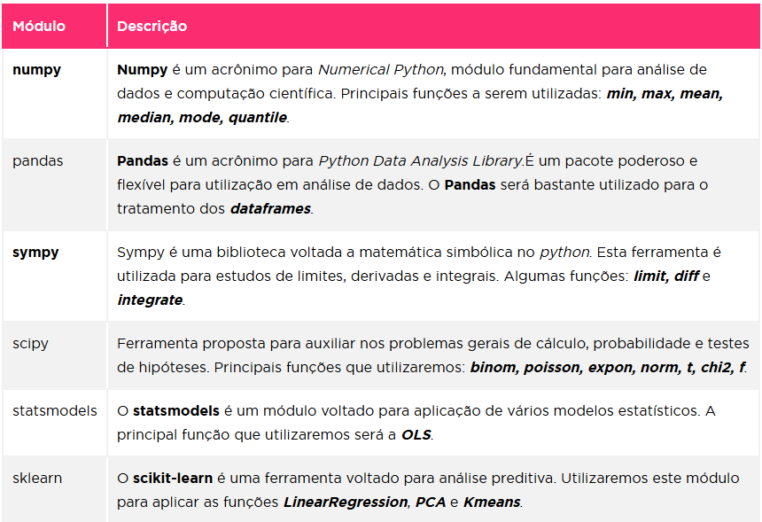

# Bibliotecas para Machine Learn

Aprendizado de maquina ou machine learn está ficando muito falado por seu poder e ultilidade na sociedade!
Esse arquivo vai te passar os principais conceitos.

## Ecossistema dos Dados

Um ecossistema de dados é como um ambiente colaborativo onde pessoas, ferramentas e informações interagem para gerar valor a partir dos dados. Nesse ambiente:

1. Recursos: são os dados em si e as ferramentas para coletar, armazenar, processar e analisar.

Exemplo: um banco de dados de clientes, um sistema de nuvem para armazenar informações.

2. Funções: são as atividades realizadas no ecossistema — produzir (coletar, limpar e organizar dados), consumir (acessar e analisar) e intermediar (transformar dados em produtos ou soluções).

Exemplo: um analista cria relatórios (produção), um gestor usa esses relatórios para tomar decisões (consumo)

3. Atores: são as pessoas que atuam no ecossistema, como engenheiros de dados, cientistas de dados, administradores de banco e especialistas em segurança.

4. Relacionamentos: são as conexões entre pessoas, recursos e ferramentas.

Exemplo: o banco de dados se conecta a uma API, que envia as informações para um painel de visualização.

## Ferramentas Gerais

Quando valamos em ferramentas para Machine Learn devemos pensar que não vamos usar apenas 1 biblioteca de aprendizado de maquina, ultilizaremos um conjunto!

Exemplo: Pandas para tratar os dados, Scipy Pegar valores complexos e frajeis. 

Para realizar um  projeto primeiro temos que definir o objetivo, quais os tipos de dados, formatos e fontes 
depois temos que aplicar transformações para garantir a qualidade dos dados.

        Após todo processo de correção, finalmente as análises são realizadas com objetivo de responder as questões de negócios levantadas. Sendo que uma das formas mais fáceis de apresentar tais resultados é por meio da visualização dos dados.
      

|Modulo | Descricao | Principais Funções |
|Numpy  | Numpy é um acronimo para Numerical python | min, max, mean, median, mode|
|Pandas | Muito ultilizado para tratar Dataframes   | columns, rows, describe, head|
|Sympy  | Lib voltada para Matematica Simbolica estuda limites, derivadas e integrais | limit, diff, integrate|
|Scipy  | Auxiliar em problemas gerais de Cálculo, probabilidade, testes de hipoteses | binom, poisson, expon, norm, t, chi2, f |
| statsmodels | modulo voltado para aplicação de modelos estatisticos | OLS |
| sklearn | Ferramenta de analise preditiva | LinearRegression, PCA e Kmeans |

