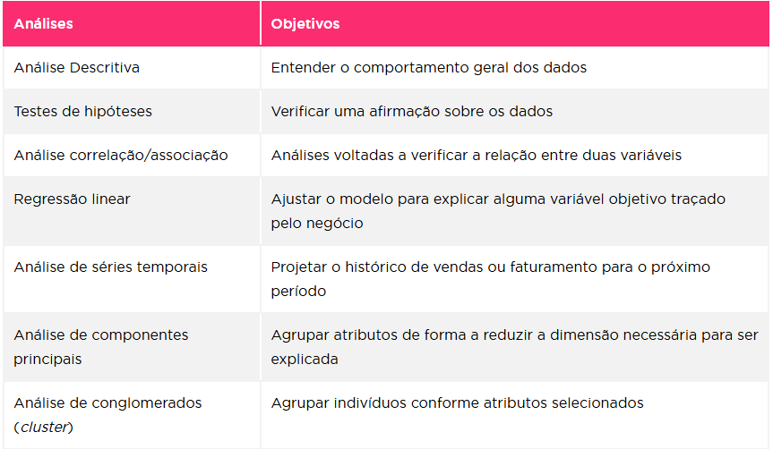

# Bibliotecas Python para Machine Learn

        Conforme Oliveira e Lóscio (2018) um ecossistema de dados é um sistema baseado em dados em que diversos indivíduos geram uma complexa troca de informações. Ecossistemas de dados são utilizados para coletar, colecionar, armazenar, analisar, transformar e processar dados e fornecem às empresas, instituições e pessoas dados nos quais elas necessitam para compreender seus desafios e tomar melhores decisões em diferentes áreas como finanças, marketing, operações, gestão pública entre outras.
      

        Este ambiente pode ser decomposto em quatro componentes: <b>Recursos, Funções, Atores </b>e<b> Relacionamentos</b>. Na figura “Ecossistema de dados”, temos um resumo sobre como funciona este ambiente.
      

